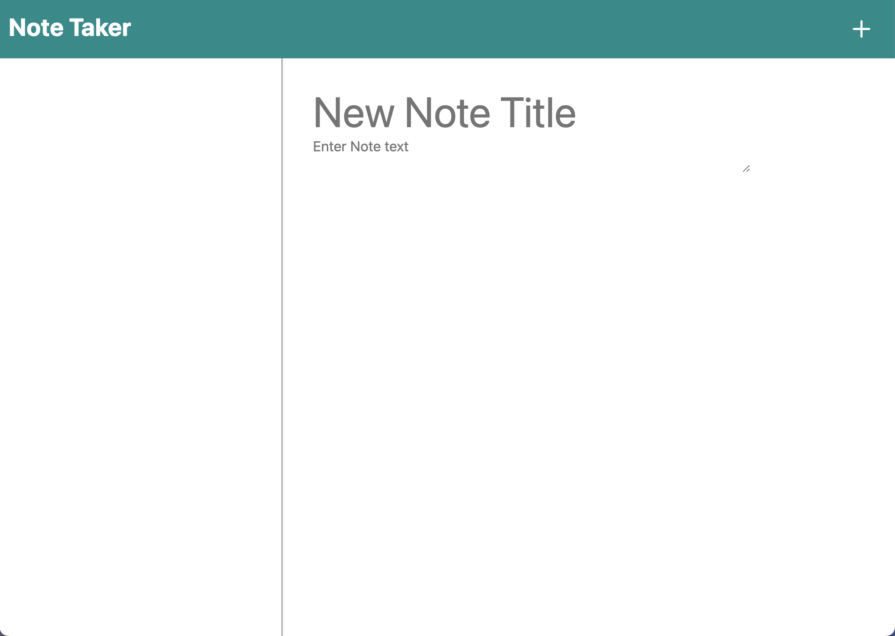

# Note Taker App
## 

## Table of Contents
- [Project Description](#project-description)
- [Installation](#installation)
- [Usage](#usage)
- [License](#license)
- [Contribution Guidelines](#contribution-guidelines)
- [Contributors](#contributors)
- [Tests](#test)
- [Questions](#questions) 

## Project Description

An app to take notes

## Installation 

npm -i

## Usage 

Enter a note title and text, click the save button to save your note.  To view your notes simply click on the desired note. To delete, click on the corresponding note trash can. To add a new note at any time click the plus symbol.

## License

This project is licensed under the MIT license.

## Contribution Guidelines

Anyone can contribute 
## Contributors 

## Tests 

## Questions

Github: [jeremytboyer](https://github.com/jeremytboyer)

Email: [jeremytboyer@gmail.com](mailto:jeremytboyer@gmail.com)
